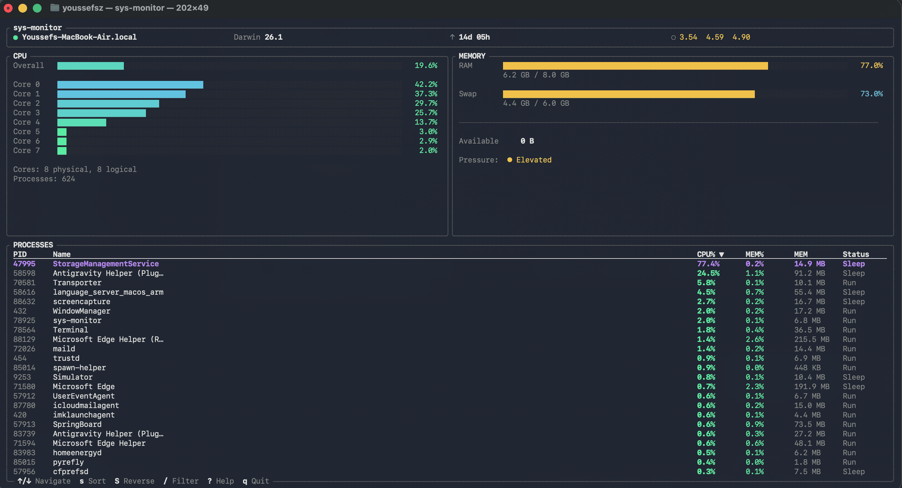

# sys-monitor

A fast, minimal terminal system monitor for macOS. Built with Rust and [Ratatui](https://github.com/ratatui/ratatui).



## Features

- **CPU overview** - Aggregate usage bar with optional per-core breakdown
- **Memory panel** - RAM and swap usage with human-readable values
- **Process table** - Top processes sorted by CPU/MEM, filterable by name
- **Host info** - Hostname, OS version, uptime, and load averages
- **Color-coded severity** - Smooth gradient from green to red based on utilization
- **Keyboard-driven** - Full navigation without a mouse
- **Help overlay** - Press `?` for a keybinding reference

## Install

### One-liner (macOS / Linux)

```sh
curl -sSL https://raw.githubusercontent.com/youssefsz/sys-monitor-Rust/master/install.sh | bash
```

### From source

Requires [Rust 1.85+](https://www.rust-lang.org/tools/install).

```sh
git clone https://github.com/youssefsz/sys-monitor-Rust.git
cd sys-monitor-Rust
cargo build --release
cp target/release/sys-monitor /usr/local/bin/
```

### Self-update

```sh
sys-monitor upgrade
```

## Usage

```sh
sys-monitor                   # launch with defaults
sys-monitor --refresh-rate 500  # custom refresh in ms (default: 250)
sys-monitor --no-per-core       # hide per-core CPU bars
```

## Keybindings

| Key | Action |
|---|---|
| `q` / `Esc` | Quit |
| `j` / `k` | Navigate process table |
| `g` / `G` | Jump to first / last process |
| `s` | Cycle sort column (CPU > MEM > PID > Name) |
| `S` | Reverse sort order |
| `/` | Filter processes by name |
| `1` | Toggle per-core CPU view |
| `r` | Force refresh |
| `?` | Show help overlay |

## Project structure

```
src/
  main.rs          Entry point, CLI parsing, terminal setup
  app.rs           Application state and input handling
  event.rs         Event polling (keyboard, tick, resize)
  system/          Data collection (CPU, memory, processes, host)
  ui/              Ratatui widgets (header, CPU, memory, processes, help)
  theme/           Color palette and style definitions
  util/            Formatting helpers (bytes, uptime, percentages)
```

## Tech stack

| Component | Crate |
|---|---|
| TUI framework | [ratatui](https://crates.io/crates/ratatui) 0.30 |
| Terminal backend | [crossterm](https://crates.io/crates/crossterm) 0.29 |
| System metrics | [sysinfo](https://crates.io/crates/sysinfo) 0.38 |
| CLI parsing | [clap](https://crates.io/crates/clap) 4.5 |
| macOS APIs | [libc](https://crates.io/crates/libc) 0.2 |

## Contributing

Contributions are welcome. Please open an issue before submitting large changes.

1. Fork the repo
2. Create a feature branch (`git checkout -b feature/my-change`)
3. Commit your changes
4. Open a pull request

## License

[MIT](LICENSE)
